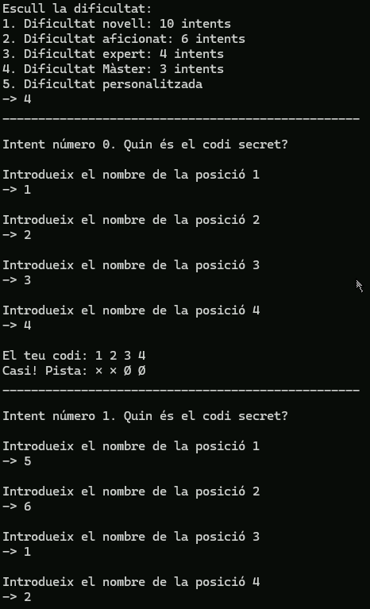
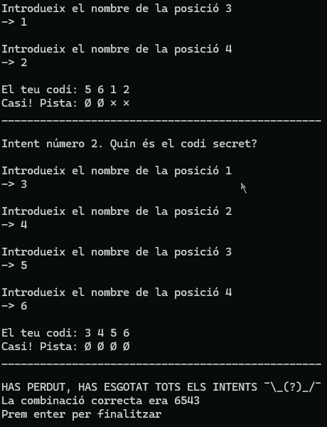
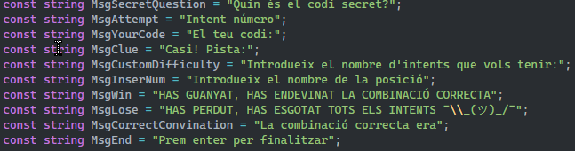

# Mastermind

Per: **Arnau Pascual**

## Instruccions

Mastermind és un joc en el que has d'endevinar un codi de 4 nombres.

Per a jugar introduïeix 4 nombres del 1 al 6, un per un. Cada cop que introdueixis 4 nombres el programa et respondrà amb una pista sobre el **Codi Secret**. A través de la pista has d'intentar endevinar el **Codi Secret**.

Aquest joc té 4 dificultats establertes, a més d'una diifcultat personalitzada:
- Dificultat novell: 10 intents
- Dificultat aficionat: 6 intents
- Dificultat expert: 4 intents
- Dificultat Màster: 3 intents
- Dificultat personalitzada: Tú esculls els intents

### Pistes:
- És en el Codi i en la seva posició -> O
- És en el Codi, però no en la posició -> Ø
- El nombre no és en el Codi -> ×

## Explicació del funcionament del programa

### Elecció de dificultat

Al seleccionar una dificultat nomès podrem escriure nombres del 1 al 5, que són les opcions de dificultat que hi ha. Si introduïm un altre valor, ja sigui una lletra o un nombre o espai, retornarà un error i tornarà a demanar el valor.

Aquests errors apareixen sempre que l'usuri introdueixi un nombre erroni.

Si escollim qualsevol de les dificultats establertes jugarem amb el nombre d'intents que tenen aquestes, però si seleccionem la dificultat personalitzada haurem de posar el nombre d'intents amb els que volem jugar.

### Endevinar el codi

Un cop tinguem els intents comença el joc de veritat. El programa demanarà 4 nombres, un per un, corresponents a cada una de les posicions del Codi Secret.

El programa contenstarà amb una pista sobre el Codi Secret.

Si endevinem el codi abans que s'acabin els intents el programa ens felicita, en cas contrari haurem perdut. El programa sepre dona el Codi Secret al final del joc.

## Joc de proves amb codis

### Codi Secret **6543**

Un codi qualsevol, per a provar una victoria i la derrota en el joc.

#### Victoria

#### Derrota amb la dificultat personalitzada a 1:

#### Derrota amb la dificultat Expert:

### Codi Secret **1346**

Amb el Codi Secret **1346** comprovem els nombres mínim i màxim possibles del codi.

### Codi Secret **6421**

Amb el Codi Secret **6421** comprovem els nombres mínim i màxim possibles del codi.

### Codi Secret **2526**

Amb el Codi Secret **2526** comprovem dos nombres iguals en el codi separats.

### Codi Secret **3411**

Amb el Codi Secret **3411** comprovem dos nombres iguals en el codi en posicions seguides.

### Codi Secret **4444**

Amb el Codi Secret **4444** comprovem tots els nombres iguals en el codi.

### Codi Secret **6666**

Amb el Codi Secret **6666** comprovem tots els nombres iguals en el codi i el valor màxim que pot tenir el codi.

## Punts entregats

### Robust

El programa s'executa sense errors i no apareix cap tracer per pantalla i fa el que es demana.

Dins del programa pots seleccionar una dificultat, cada una té un nombre d'intents diferent, a més d'una dificultat personalitzada per a seleccionar els intents personalment. Un cop definits els intents el programa compara un codi introduït per l'usuari amb el que té guardat el programa, això es repeteix fins que els intents de l'usuari s'acabin, en aquest cas, si els no l'ha endevinat en l'últim intent el programa s'acaba amb una derrota.

### Claredat i ordre

El programa es segueix amb claredat, de dalt a baix, cada ordre va seguida d'una altra. Les instruccions són suficients clares com per entendre-les.

Tot el codi utilitzat per al programa l'hem treballat a classe.

Les funcions es criden de dalt a baix, qui la crida a dalt, i la funció abaix. També aquestes només realitzen una funció.

Els comentaris està col·locats per a explicar el funcionament d'algunes parts del codi.

### Variables i constants

Totes les variables i constats del programa tenen noms que nomès en saber el seu nom es pot deduïr per a que serveixen, a més de que tot està escrit en anglès.

Tots els textos que utilitza el programa està declarats en constats, no hi ha cap text que s'utilitzu que no estigui dintre d'una.

Totes les variables i constats està declarades al principi del codi.

### Estructures de control

Totes les condicions del codi són correctes i no provoquen errors en el programa. Aquestes sempre tenen algún ús dins del codi.

L'única sentència break que s'utilitza està en un switch.

### Gestió d'errors

Tots els errors que es pot produïr està controlats.

### Disseny modular

Els processos que es repeteixen més d'una vegada estàn dins de mètodes per a no haver de repetir el codi.

### UX/UI

Els missatges ajuden a entendre millor el joc, i encaminen a l'usuari a jugar correctament.

### Extra 3

El codi utilitza un títol gran i llegible per una major inmersió al joc, a més hi ha separacions per a llegirr millor cada part del programa.

